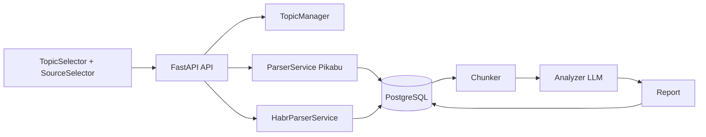

# Технический дизайн: Интеграция Habr

## Обзор

Расширение существующего сервиса «Pikabu Topic Analyzer» для поддержки парсинга и анализа статей с habr.com. Основная идея — минимальные изменения в существующей архитектуре: добавляется новый парсер `HabrParserService`, в БД добавляется колонка `source` для различения источников, API расширяется параметром `source`, а фронтенд получает переключатель режима источника.

Пайплайн анализа (chunker → analyzer → aggregation) остаётся без изменений — он просто получает больше постов на вход.

## Архитектура

Текущая архитектура — линейный пайплайн:

```
TopicSelector (Vue) → API (FastAPI) → ParserService → DB → Chunker → Analyzer → Report
```

После интеграции Habr:



Ключевые решения:
- `HabrParserService` — отдельный класс в `backend/app/services/habr_parser.py`, аналогичный `ParserService`
- Используется `curl_cffi` для HTTP-запросов (как и Pikabu-парсер), но без прокси
- Таблицы `topics` и `posts` получают колонку `source` (`"pikabu"` / `"habr"`)
- Колонка `pikabu_id` в `topics` переименовывается логически в `source_id` (но физически остаётся `pikabu_id` для обратной совместимости, значение заполняется с префиксом `habr_` для Habr-тем)
- Колонка `pikabu_post_id` в `posts` аналогично используется для обоих источников
- Потоки Habr хранятся как предопределённый список (аналогично `FALLBACK_COMMUNITIES` для Pikabu)

## Компоненты и интерфейсы

### 1. HabrParserService (`backend/app/services/habr_parser.py`)

Новый сервис для парсинга статей и комментариев с habr.com.

```python
class HabrParserService:
    def __init__(self, session: AsyncSession) -> None: ...

    async def parse_topic(
        self, topic_id: int, callback: ProgressCallback = None, days: int = 30
    ) -> dict:
        """Парсит статьи из потока Habr. Возвращает {posts_count, comments_count}."""

    async def parse_posts(self, flow_url: str, since: datetime) -> list[dict]:
        """Извлекает статьи из страницы потока с пагинацией."""

    async def parse_comments(self, article_url: str) -> list[dict]:
        """Извлекает комментарии со страницы статьи."""

    @staticmethod
    def _extract_posts_from_html(html: str) -> list[dict]:
        """Извлекает данные статей из HTML потока Habr."""

    @staticmethod
    def _extract_comments_from_html(html: str) -> list[dict]:
        """Извлекает комментарии из HTML страницы статьи Habr."""

    async def _fetch_page(self, url: str) -> str:
        """HTTP-запрос с retry-логикой (429, 5xx). Без прокси."""
```

Интерфейс идентичен `ParserService` — это позволяет использовать оба парсера взаимозаменяемо в пайплайне.

### 2. CSS-селекторы для Habr

На основе анализа HTML-структуры habr.com:

**Страница потока** (`/ru/flows/{name}/articles/`):
- Карточка статьи: `article.tm-articles-list__item`
- Заголовок: `a.tm-title__link` (текст — заголовок, `href` — URL)
- Тело/описание: `.tm-article-body` или `.article-formatted-body`
- Дата: `time[datetime]` или `span.tm-article-datetime-published time`
- Рейтинг: `.tm-votes-meter__value`
- Количество комментариев: `.tm-article-comments-counter-link__value`
- ID статьи: из URL (`/articles/{id}/`)

**Страница статьи** (комментарии):
- Блок комментария: `.tm-comment-thread__comment`
- Текст комментария: `.tm-comment__body-content`
- Дата комментария: `.tm-comment-datetime time[datetime]`
- Рейтинг комментария: `.tm-votes-lever__score-count`
- ID комментария: из атрибута `id` элемента или `data-comment-id`

**Пагинация**:
- URL: `https://habr.com/ru/flows/{name}/articles/page{N}/`
- Наличие следующей страницы: `a.tm-pagination__page` или отсутствие статей на странице

### 3. Изменения в TopicManager (`backend/app/services/topic_manager.py`)

Добавляется предопределённый список потоков Habr:

```python
HABR_FLOWS = [
    {"pikabu_id": "habr_management", "name": "Менеджмент", "url": "https://habr.com/ru/flows/management/articles/", "subscribers_count": None, "source": "habr"},
    {"pikabu_id": "habr_top_management", "name": "Топ-менеджмент", "url": "https://habr.com/ru/flows/top_management/articles/", "subscribers_count": None, "source": "habr"},
    {"pikabu_id": "habr_marketing", "name": "Маркетинг", "url": "https://habr.com/ru/flows/marketing/articles/", "subscribers_count": None, "source": "habr"},
]
```

Метод `fetch_topics` расширяется параметром `source`:
- `"pikabu"` — только Pikabu-темы (текущее поведение)
- `"habr"` — только Habr-потоки
- `"both"` — и то, и другое

### 4. Изменения в API (`backend/app/api/router.py`)

**GET /api/topics**:
- Новый query-параметр: `source: str = "pikabu"` (значения: `"pikabu"`, `"habr"`, `"both"`)
- При `source="pikabu"` — текущее поведение (обратная совместимость)
- При `source="habr"` — возвращает только Habr-потоки
- При `source="both"` — возвращает всё

**POST /api/analysis/start**:
- Расширение `AnalysisStartRequest`:
  ```python
  class AnalysisStartRequest(BaseModel):
      topic_id: int
      days: int = 30
      source: str = "pikabu"  # "pikabu", "habr", "both"
      habr_topic_id: int | None = None  # для режима "both"
  ```
- При `source="habr"` — используется `HabrParserService`
- При `source="both"` — последовательно парсятся оба источника, данные объединяются

### 5. Изменения во фронтенде

**TopicSelector.vue**:
- Добавляется переключатель источника (три кнопки: Pikabu / Habr / Pikabu + Habr)
- При переключении — перезагрузка списка тем с параметром `source`
- В режиме `"both"` — два списка тем с визуальным разделением (бейджи «Pikabu» / «Habr»)
- При `"both"` — пользователь выбирает по одной теме из каждого источника

**api/client.ts**:
- `getTopics(search?, source?)` — добавляется параметр `source`
- `startAnalysis(topicId, days, source?, habrTopicId?)` — расширяется

**types/api.ts**:
- `Topic` — добавляется поле `source?: string`
- `AnalysisStartRequest` — добавляются `source`, `habr_topic_id`

**ReportView.vue**:
- Отображение бейджа источника в заголовке отчёта
- Ссылки на оригинальные посты с указанием платформы

### 6. Изменения в пайплайне (`backend/app/services/pipeline.py` и `router.py`)

Фоновая задача `_run_analysis_background` расширяется:
- Принимает параметр `source`
- При `source="pikabu"` — текущее поведение
- При `source="habr"` — использует `HabrParserService`
- При `source="both"` — последовательно парсит оба источника, затем загружает все посты для чанкинга

Функция `_load_posts_as_dicts` — без изменений (загружает все посты по `topic_id`). Для режима `"both"` загружаются посты по обоим `topic_id`.

## Модели данных

### Изменения в БД (Alembic-миграция)

**Таблица `topics`** — добавляется колонка:
```sql
ALTER TABLE topics ADD COLUMN source VARCHAR(20) NOT NULL DEFAULT 'pikabu';
CREATE INDEX idx_topics_source ON topics(source);
```

**Таблица `posts`** — добавляется колонка:
```sql
ALTER TABLE posts ADD COLUMN source VARCHAR(20) NOT NULL DEFAULT 'pikabu';
CREATE INDEX idx_posts_source ON posts(source);
```

**Таблица `reports`** — добавляется колонка:
```sql
ALTER TABLE reports ADD COLUMN sources VARCHAR(50) NOT NULL DEFAULT 'pikabu';
```
Значения: `"pikabu"`, `"habr"`, `"pikabu,habr"`.

### Изменения в ORM-моделях (`backend/app/models/database.py`)

```python
class Topic(Base):
    # ... существующие поля ...
    source = Column(String(20), nullable=False, default="pikabu")

class Post(Base):
    # ... существующие поля ...
    source = Column(String(20), nullable=False, default="pikabu")

class Report(Base):
    # ... существующие поля ...
    sources = Column(String(50), nullable=False, default="pikabu")
```

### Изменения в Pydantic-схемах (`backend/app/models/schemas.py`)

```python
class Topic(BaseModel):
    # ... существующие поля ...
    source: str = "pikabu"

class AnalysisStartRequest(BaseModel):
    topic_id: int
    days: int = 30
    source: str = "pikabu"
    habr_topic_id: int | None = None

class Report(BaseModel):
    # ... существующие поля ...
    sources: str = "pikabu"
```

## Свойства корректности

*Свойство (property) — это характеристика или поведение, которое должно выполняться для всех допустимых входных данных системы. Свойства служат мостом между человекочитаемыми спецификациями и машинно-проверяемыми гарантиями корректности.*

### Свойство 1: Фильтрация тем по источнику

*Для любого* набора тем с разными значениями `source` и *для любого* значения фильтра `source` ∈ {"pikabu", "habr", "both"}, результат фильтрации должен содержать только темы с соответствующим `source` (при "both" — все темы).

**Validates: Requirements 1.4, 1.5, 8.1**

### Свойство 2: Валидность формата потоков Habr

*Для любого* потока Habr из предопределённого списка, его представление должно содержать: `pikabu_id` с префиксом `"habr_"`, `url` соответствующий шаблону `https://habr.com/ru/flows/{name}/articles/`, и все обязательные поля модели `Topic` (id, name, url).

**Validates: Requirements 2.2, 2.3, 2.4**

### Свойство 3: Полнота извлечения данных статей

*Для любого* валидного HTML-фрагмента, содержащего статьи Habr, каждая извлечённая статья должна содержать все обязательные поля: `title` (непустой), `body`, `published_at` (валидный datetime), `rating` (int), `comments_count` (int ≥ 0), `url` (непустой), `pikabu_post_id` (непустой).

**Validates: Requirements 3.2, 9.1, 9.4**

### Свойство 4: Ранний выход при устаревших статьях

*Для любого* набора страниц потока, где статьи отсортированы по дате от новых к старым, парсер должен прекратить пагинацию, когда все статьи на текущей странице имеют дату публикации старше запрошенного периода `since`.

**Validates: Requirements 3.4**

### Свойство 5: Полнота извлечения комментариев

*Для любого* валидного HTML-фрагмента, содержащего комментарии Habr, каждый извлечённый комментарий должен содержать: `body` (непустой), `published_at` (валидный datetime), `rating` (int).

**Validates: Requirements 4.2, 9.2**

### Свойство 6: Валидность кэша

*Для любого* topic_id, если `parse_metadata.last_parsed_at` менее 24 часов назад, повторный запрос анализа не должен вызывать парсинг (используются кэшированные данные).

**Validates: Requirements 5.5**

### Свойство 7: Полнота объединённых данных

*Для любых* двух наборов постов (из Pikabu и Habr), объединённый набор для чанкинга должен содержать все посты из обоих наборов без потерь и дубликатов.

**Validates: Requirements 6.2**

### Свойство 8: Валидность источников в отчёте

*Для любого* отчёта, поле `sources` должно содержать валидное значение из множества {"pikabu", "habr", "pikabu,habr"} и соответствовать фактически использованным источникам данных.

**Validates: Requirements 7.1, 7.4**

### Свойство 9: Round-trip парсинга статей

*Для любого* набора структурированных данных статей, если сгенерировать из них HTML-фрагмент в формате Habr и затем распарсить его обратно, результат должен содержать эквивалентные данные (заголовок, URL, дата, рейтинг).

**Validates: Requirements 9.5**

## Обработка ошибок

| Ситуация | Поведение |
|---|---|
| HTTP 429 от habr.com | Пауза 60 сек, повтор (до 5 раз) |
| HTTP 5xx от habr.com | Повтор до 3 раз с интервалом 10 сек |
| Сетевая ошибка | Повтор до 3 раз с интервалом 15 сек |
| Ошибка парсинга комментариев | Пропуск комментариев статьи, продолжение парсинга |
| Невалидный HTML (нет статей) | Возврат пустого списка, прекращение пагинации |
| source="habr"/"both" без habr_topic_id | HTTP 400 с описанием ошибки |
| Тема не найдена | HTTP 404 |
| Ошибка LLM при анализе | Существующая retry-логика в AnalyzerService |
| Ошибка парсинга одного из источников в режиме "both" | Задача помечается как failed, частичные результаты сохраняются |

## Стратегия тестирования

### Property-based тесты (Hypothesis)

Библиотека: `hypothesis` (уже используется в проекте).

Каждый property-тест запускается минимум 100 итераций. Теги в формате:
`Feature: habr-integration, Property {N}: {описание}`

Свойства для PBT:
1. **Фильтрация тем по источнику** — генерируем случайные списки тем с разными source, проверяем фильтрацию
2. **Валидность формата потоков Habr** — проверяем предопределённый список
3. **Полнота извлечения статей** — генерируем HTML с случайными статьями, парсим
4. **Ранний выход** — генерируем страницы с датами, проверяем остановку
5. **Полнота извлечения комментариев** — генерируем HTML с комментариями, парсим
6. **Валидность кэша** — генерируем случайные timestamps, проверяем решение кэша
7. **Полнота объединённых данных** — генерируем два набора, объединяем
8. **Валидность источников в отчёте** — генерируем отчёты с разными source
9. **Round-trip парсинга** — генерируем данные → HTML → парсинг → сравнение

### Unit-тесты

- Конкретные примеры парсинга реального HTML Habr (snapshot)
- Retry-логика: мок 429, мок 5xx
- API endpoints: проверка параметров, валидация, обратная совместимость
- Значения по умолчанию (source="pikabu" при отсутствии параметра)
- Edge cases: пустой HTML, невалидный HTML, отсутствие комментариев

### Интеграционные тесты

- Полный пайплайн с моками парсеров для режимов "pikabu", "habr", "both"
- Сохранение и загрузка данных из БД с полем source
- Миграция: проверка что существующие данные получают source="pikabu"

