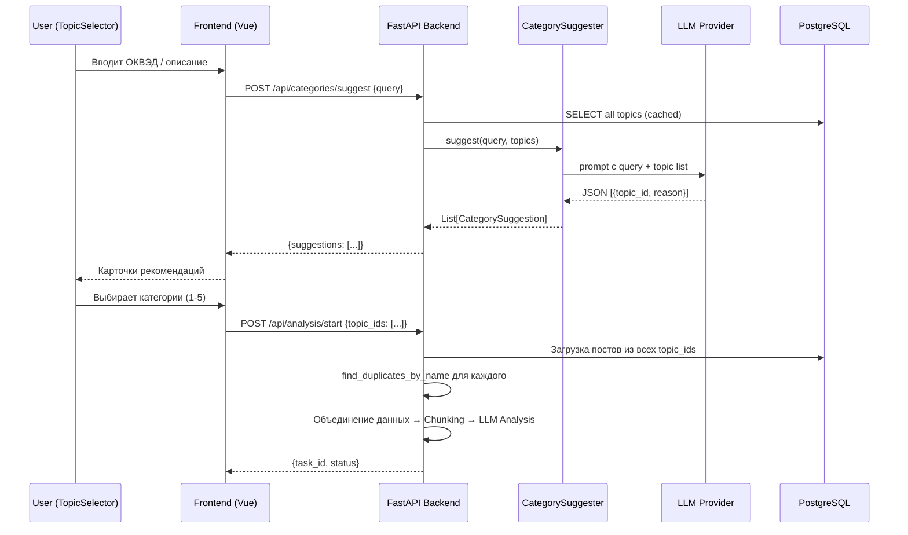
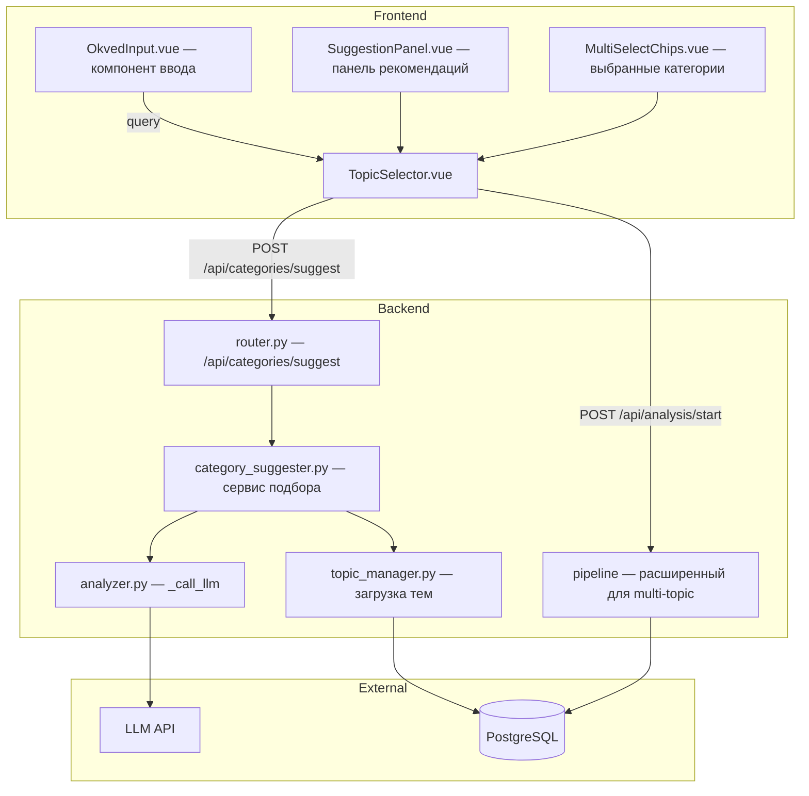

# Design Document: Категории бизнеса по ОКВЭД

## Overview

Фича расширяет страницу выбора категорий (TopicSelector.vue) новым способом ввода: пользователь указывает ОКВЭД-код или текстовое описание деятельности, а бэкенд через LLM подбирает 2–5 релевантных категорий из существующего пула Topic. Результат отображается как карточки-рекомендации с обоснованием. Пользователь может принять все, выбрать отдельные, комбинировать с ручным поиском и запустить объединённый анализ по нескольким категориям.

### Ключевые решения

- **Без отдельной таблицы ОКВЭД**: LLM получает полный список категорий из БД и самостоятельно соотносит ввод пользователя с существующими Topic. Это избавляет от поддержки справочника ОКВЭД.
- **Расширение API**: новый эндпоинт `POST /api/categories/suggest` для подбора, расширение `POST /api/analysis/start` для массива `topic_ids`.
- **Обратная совместимость**: существующий формат `topic_id: int` продолжает работать; новый `topic_ids: list[int]` — опционален.
- **Multi-select UI**: панель выбранных категорий (chips) с лимитом 5 штук.

## Architecture



### Компоненты системы



## Components and Interfaces

### Backend

#### 1. `CategorySuggester` (новый сервис: `backend/app/services/category_suggester.py`)

```python
from pydantic import BaseModel

class CategorySuggestion(BaseModel):
    topic_id: int
    name: str
    reason: str  # до 100 символов

class CategorySuggesterService:
    """Подбирает релевантные категории через LLM."""

    def __init__(self, session: AsyncSession):
        self._session = session
        self._analyzer = AnalyzerService()
        self._topic_manager = TopicManager(session)

    async def suggest(self, query: str) -> list[CategorySuggestion]:
        """
        Принимает ОКВЭД-код или описание, возвращает 2-5 рекомендаций.
        
        Raises:
            ValueError: если query < 2 или > 200 символов
            CategorySuggesterError: при ошибке LLM (timeout, parse error)
        """
        ...

    def _build_prompt(self, query: str, topics: list[Topic]) -> str:
        """Формирует промпт для LLM с полным списком категорий."""
        ...

    def _parse_response(self, text: str, valid_ids: set[int]) -> list[CategorySuggestion]:
        """Парсит JSON-ответ LLM, фильтрует несуществующие topic_id."""
        ...
```

#### 2. Новый API эндпоинт (`router.py`)

```python
# POST /api/categories/suggest
class CategorySuggestRequest(BaseModel):
    query: str  # 2-200 символов

class CategorySuggestResponse(BaseModel):
    suggestions: list[CategorySuggestion]
    message: str = ""  # пояснительное сообщение при пустом результате
```

#### 3. Расширение `AnalysisStartRequest`

```python
class AnalysisStartRequest(BaseModel):
    topic_id: int | None = None        # backward compat: одна категория
    topic_ids: list[int] | None = None # новое: несколько категорий (1-5)
    # ... остальные поля без изменений
```

Валидация: ровно одно из `topic_id` / `topic_ids` должно быть задано. Если задан `topic_id` — внутренне оборачивается в `[topic_id]`.

### Frontend

#### 1. `OkvedInput.vue` — компонент ввода ОКВЭД

- Текстовое поле с placeholder "Введите ОКВЭД-код или описание деятельности"
- Кнопка «Подобрать категории» (активна при ≥ 2 символах)
- Состояния: idle, loading (spinner), error

#### 2. `SuggestionPanel.vue` — панель рекомендаций

- Список карточек: название + обоснование
- Кнопка «Принять все»
- Клик по карточке добавляет категорию в выбранные
- Сообщение-fallback при пустом ответе

#### 3. `MultiSelectChips.vue` — чипсы выбранных категорий

- Отображает выбранные категории (1-5) с кнопкой ×
- Счётчик: "Выбрано: N / 5"
- Предупреждение при попытке добавить >5

#### 4. Изменения в `TopicSelector.vue`

- Интеграция OkvedInput над текущим поиском
- Замена `selectedTopic: Topic | null` на `selectedTopics: Topic[]`
- Кнопка «Далее» передаёт `topic_ids` вместо `topic_id`

## Data Models

### Новые Pydantic-схемы (`schemas.py`)

```python
class CategorySuggestion(BaseModel):
    """Рекомендация категории от LLM."""
    topic_id: int
    name: str
    reason: str  # Обоснование, до 100 символов

class CategorySuggestRequest(BaseModel):
    """Запрос на подбор категорий."""
    query: str

    @field_validator("query")
    @classmethod
    def validate_query_length(cls, v: str) -> str:
        v = v.strip()
        if len(v) < 2:
            raise ValueError("Минимум 2 символа")
        if len(v) > 200:
            raise ValueError("Максимум 200 символов")
        return v

class CategorySuggestResponse(BaseModel):
    """Ответ с рекомендациями."""
    suggestions: list[CategorySuggestion]
    message: str = ""
```

### Расширение `AnalysisStartRequest`

```python
class AnalysisStartRequest(BaseModel):
    topic_id: int | None = None
    topic_ids: list[int] | None = None
    days: int = 14
    analysis_mode: str = "niche_search"
    fingerprint: str = ""
    contact_type: str = ""
    contact_value: str = ""
    wait_on_page: bool = False

    @model_validator(mode="after")
    def validate_topic_selection(self) -> "AnalysisStartRequest":
        if self.topic_id is None and not self.topic_ids:
            raise ValueError("Укажите topic_id или topic_ids")
        if self.topic_id is not None and self.topic_ids:
            raise ValueError("Укажите только topic_id или topic_ids, не оба")
        if self.topic_ids and len(self.topic_ids) > 5:
            raise ValueError("Максимум 5 категорий")
        return self
```

### Изменения в БД

Новых таблиц и миграций не требуется — фича работает с существующими Topic и AnalysisTask. Отчёт привязывается к первому topic_id из списка (primary_topic_id) для обратной совместимости.

### TypeScript интерфейсы

```typescript
export interface CategorySuggestion {
  topic_id: number
  name: string
  reason: string
}

export interface CategorySuggestResponse {
  suggestions: CategorySuggestion[]
  message: string
}

// Расширение AnalysisStartRequest
export interface AnalysisStartRequest {
  topic_id?: number
  topic_ids?: number[]
  days?: number
  analysis_mode?: string
  fingerprint?: string
  contact_type?: string
  contact_value?: string
  wait_on_page?: boolean
}
```

### LLM Prompt (Category Suggester)

```
Ты — эксперт по классификации бизнеса. Пользователь описал свою деятельность: "{query}".

Ниже — список доступных категорий для анализа (id | название):
{topics_formatted}

Подбери от 2 до 5 наиболее релевантных категорий. Для каждой укажи обоснование (до 100 символов).

Ответь строго в JSON:
[
  {"topic_id": 123, "name": "Маркетинг", "reason": "..."},
  ...
]

Правила:
- Используй ТОЛЬКО topic_id из списка выше
- Если ввод — ОКВЭД-код, определи вид деятельности и подбери категории
- Если не можешь подобрать — верни пустой массив []
- Не придумывай категории, которых нет в списке
```


## Correctness Properties

*A property is a characteristic or behavior that should hold true across all valid executions of a system — essentially, a formal statement about what the system should do. Properties serve as the bridge between human-readable specifications and machine-verifiable correctness guarantees.*

### Property 1: Валидация длины запроса

*For any* строку `query`, валидатор `CategorySuggestRequest` SHALL принимать её тогда и только тогда, когда `2 ≤ len(query.strip()) ≤ 200`. Строки короче 2 или длиннее 200 символов после trim SHALL вызывать `ValidationError`.

**Validates: Requirements 1.3, 1.4**

### Property 2: Парсинг ответа LLM — корректность структуры и количества

*For any* валидного JSON-ответа от LLM и множества допустимых `topic_id`, метод `_parse_response` SHALL вернуть список из 0–5 объектов `CategorySuggestion`, где каждый объект содержит `topic_id` из допустимого множества, непустое `name`, и `reason` длиной ≤ 100 символов. Если LLM вернул >5, результат обрезается до 5. Если LLM вернул <2 валидных — возвращается пустой список.

**Validates: Requirements 2.2, 2.3**

### Property 3: Добавление категорий в выбор (индивидуально и массово)

*For any* набора рекомендаций (2-5 штук) и пустого начального выбора: клик по отдельной рекомендации SHALL добавить ровно эту категорию в `selectedTopics`; нажатие «Принять все» SHALL добавить все рекомендации в `selectedTopics`. После обоих действий каждая добавленная категория должна присутствовать в `selectedTopics`.

**Validates: Requirements 3.2, 3.3, 5.2**

### Property 4: Инвариант выбора — размер и toggle

*For any* последовательности операций добавления/удаления категорий, размер `selectedTopics` SHALL всегда находиться в диапазоне [0, 5]. Повторный клик по уже выбранной категории SHALL удалить её из выбора (toggle). Попытка добавить 6-ю категорию SHALL быть отклонена без изменения состояния.

**Validates: Requirements 4.1, 4.2, 4.3, 4.4, 5.3**

### Property 5: API payload содержит все выбранные topic_ids

*For any* набора выбранных категорий (1-5 штук), при нажатии «Далее» отправляемый запрос к `/api/analysis/start` SHALL содержать поле `topic_ids` с массивом, включающим `topic_id` каждой выбранной категории, без дупликатов и без пропусков.

**Validates: Requirements 6.1**

### Property 6: Pipeline загружает посты из всех запрошенных категорий

*For any* набора `topic_ids` (1-5), каждый из которых содержит посты в БД, pipeline SHALL загрузить и включить в `posts_data` посты из КАЖДОГО указанного `topic_id` (объединение). Множество topic_id загруженных постов SHALL быть надмножеством входного `topic_ids`.

**Validates: Requirements 6.2**

### Property 7: Обратная совместимость — topic_id XOR topic_ids

*For any* запроса к `/api/analysis/start`, валидатор SHALL принимать запрос тогда и только тогда, когда указано ровно одно из полей: `topic_id` (int) или `topic_ids` (list[int], 1-5 элементов). Запросы с обоими полями, без обоих полей, или с `topic_ids` длиной >5 SHALL быть отклонены.

**Validates: Requirements 7.3**

## Error Handling

### Backend

| Ситуация | Код | Ответ | Действие |
|----------|-----|-------|----------|
| query < 2 или > 200 символов | 422 | `{"detail": "Длина запроса должна быть от 2 до 200 символов"}` | Pydantic validator |
| LLM timeout (>10s) | 503 | `{"detail": "Сервис подбора временно недоступен. Выберите категории вручную."}` | httpx.TimeoutException catch |
| LLM HTTP error (4xx/5xx) | 503 | `{"detail": "Сервис подбора временно недоступен. Выберите категории вручную."}` | httpx.HTTPStatusError catch |
| LLM вернул невалидный JSON | 503 | `{"detail": "..."}` | JSONDecodeError → retry 1x, затем 503 |
| LLM вернул topic_id не из пула | — | Фильтруется молча | `_parse_response` исключает невалидные ID |
| topic_ids содержит несуществующий ID | 404 | `{"detail": "Topic {id} not found"}` | Проверка перед запуском |
| topic_ids > 5 | 422 | `{"detail": "Максимум 5 категорий"}` | Pydantic validator |
| Оба topic_id и topic_ids заданы | 422 | `{"detail": "Укажите только topic_id или topic_ids, не оба"}` | model_validator |

### Frontend

| Ситуация | UX |
|----------|-----|
| Загрузка рекомендаций | Spinner внутри кнопки «Подобрать» |
| 503 от suggest | Toast «Не удалось подобрать. Выберите вручную.» + переход к полному списку |
| Пустые рекомендации | Текст «Не удалось подобрать категории для данного описания» + доступ к ручному выбору |
| Превышен лимит 5 | Toast «Максимум 5 категорий» (1.5s auto-dismiss) |
| Сетевая ошибка | Красная плашка с сообщением, кнопка «Повторить» |

## Testing Strategy

### Unit Tests (pytest)

- **CategorySuggestRequest validator**: пограничные значения длины (1, 2, 200, 201, пустая строка, только пробелы)
- **AnalysisStartRequest validator**: topic_id only, topic_ids only, both, neither, topic_ids длиной 0/1/5/6
- **_parse_response**: валидный JSON, невалидные topic_id, пустой массив, >5 элементов, reason >100 символов (обрезка)
- **_build_prompt**: корректное форматирование списка тем
- **Pipeline multi-topic loading**: загрузка постов из нескольких topic_id, пропуск пустых

### Property-Based Tests (hypothesis)

Библиотека: **hypothesis** (уже используется в проекте).

Конфигурация: минимум 100 итераций на свойство (`@settings(max_examples=100)`).

Каждый тест помечается комментарием:
```python
# Feature: okved-categories, Property N: <property text>
```

Свойства для реализации:
1. **Property 1** — генерация строк произвольной длины (0-500), проверка accept/reject
2. **Property 2** — генерация JSON-подобных структур с рандомными topic_id/name/reason, проверка парсинга
3. **Property 4** — генерация последовательностей операций (add/remove/toggle), проверка инварианта [0,5]
4. **Property 5** — генерация наборов Topic (1-5), проверка формирования payload
5. **Property 6** — генерация topic_ids с постами в mock-БД, проверка объединения
6. **Property 7** — генерация комбинаций topic_id/topic_ids, проверка валидации

### Integration Tests

- Полный цикл `POST /api/categories/suggest` с мокнутым LLM
- `POST /api/analysis/start` с `topic_ids` → запуск pipeline (mocked parsers/LLM)
- Backward compat: `topic_id` по-прежнему работает без изменений

### Frontend Tests (vitest + vue-test-utils)

- `OkvedInput.vue`: кнопка скрыта при <2 символах, видна при ≥2
- `SuggestionPanel.vue`: рендеринг карточек, клик добавляет, Accept All добавляет все
- `MultiSelectChips.vue`: отображение, удаление через ×, лимит 5
- `TopicSelector.vue` интеграция: полный flow от ввода до «Далее»
