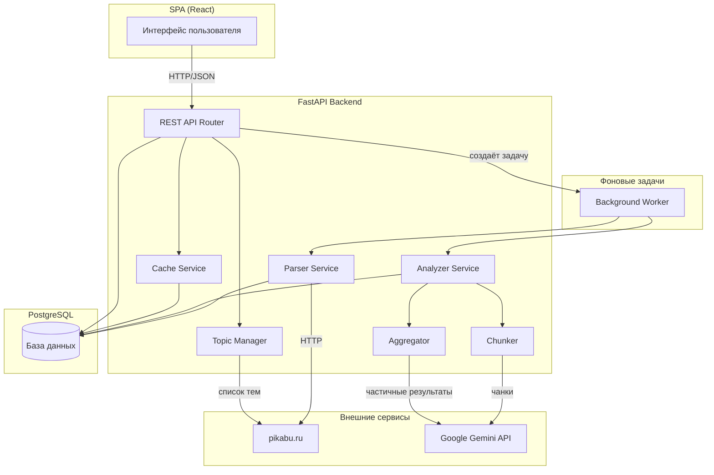
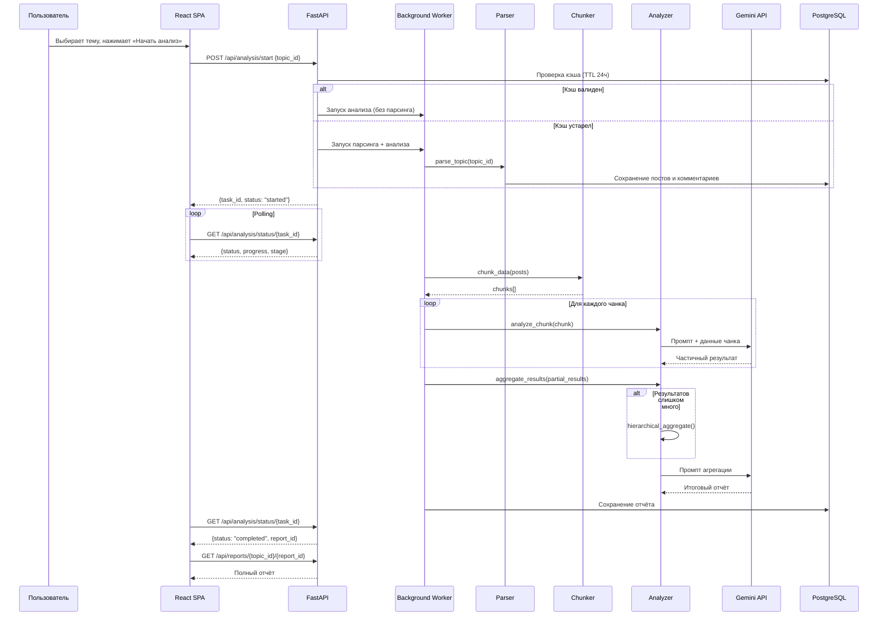

# Технический дизайн: Pikabu Topic Analyzer

## Обзор

Pikabu Topic Analyzer — это веб-приложение для автоматического анализа контента на pikabu.ru. Система состоит из трёх основных слоёв: SPA-фронтенд (React), FastAPI-бэкенд и PostgreSQL-хранилище. Ключевая особенность — многоэтапный конвейер анализа, который разбивает большие объёмы данных на чанки, анализирует каждый через Google Gemini API и иерархически агрегирует результаты в итоговый отчёт.

Основные потоки данных:
1. Пользователь выбирает тему → Система парсит pikabu.ru → Данные сохраняются в PostgreSQL
2. Данные разбиваются на чанки → Каждый чанк анализируется Gemini API → Частичные результаты агрегируются → Итоговый отчёт

## Архитектура



### Архитектурные решения

1. **Фоновые задачи**: Парсинг и анализ выполняются асинхронно через фоновые задачи (asyncio tasks или Celery). API возвращает `task_id`, клиент опрашивает статус через polling.

2. **Кэширование**: Спарсенные данные кэшируются в PostgreSQL с TTL 24 часа. При повторном запросе в пределах TTL парсинг не запускается.

3. **Чанкинг**: Данные разбиваются на чанки размером ≤80% контекстного окна Gemini API. Если частичных результатов слишком много для одной агрегации, применяется иерархическая агрегация.

4. **Rate limiting**: Для pikabu.ru — пауза 60 сек при HTTP 429, до 3 ретраев при 5xx. Для Gemini API — до 3 ретраев с экспоненциальной задержкой.

## Компоненты и интерфейсы

### Backend-компоненты

#### 1. REST API Router (`api/router.py`)

Маршруты FastAPI, соответствующие требованию 8:

```python
GET  /api/topics                        → TopicListResponse
POST /api/analysis/start                → AnalysisStartResponse  
GET  /api/analysis/status/{task_id}     → AnalysisStatusResponse
GET  /api/reports/{topic_id}            → ReportListResponse
GET  /api/reports/{topic_id}/{report_id}→ ReportDetailResponse
```

#### 2. Topic Manager (`services/topic_manager.py`)

Загружает и кэширует список доступных тем (сообществ/тегов) с pikabu.ru.

```python
class TopicManager:
    async def fetch_topics() -> list[Topic]
    async def get_topic_info(topic_id: str) -> TopicInfo
```

#### 3. Parser Service (`services/parser.py`)

Парсит посты и комментарии с pikabu.ru с помощью BeautifulSoup/Scrapy.

```python
class ParserService:
    async def parse_topic(topic_id: str, callback: ProgressCallback) -> ParseResult
    async def parse_posts(topic_id: str, since: datetime) -> list[Post]
    async def parse_comments(post_url: str) -> list[Comment]
```

Включает retry-логику:
- HTTP 429 → пауза 60 сек, повтор
- HTTP 5xx → до 3 повторов с интервалом 10 сек

#### 4. Chunker (`services/chunker.py`)

Разбивает собранные данные на чанки для Gemini API.

```python
class Chunker:
    def chunk_data(posts: list[Post], max_tokens: int) -> list[Chunk]
    def estimate_tokens(text: str) -> int
```

Размер чанка ≤ 80% лимита контекстного окна Gemini API.

#### 5. Analyzer Service (`services/analyzer.py`)

Многоэтапный анализ через Gemini API.

```python
class AnalyzerService:
    async def analyze_chunk(chunk: Chunk) -> PartialResult
    async def aggregate_results(results: list[PartialResult]) -> Report
    async def hierarchical_aggregate(results: list[PartialResult], max_group_size: int) -> Report
    async def run_full_analysis(topic_id: str, callback: ProgressCallback) -> Report
```

Retry-логика: до 3 попыток с экспоненциальной задержкой.

#### 6. Cache Service (`services/cache.py`)

Управление кэшем спарсенных данных.

```python
class CacheService:
    async def get_cached_data(topic_id: str) -> CachedData | None
    async def is_cache_valid(topic_id: str, ttl_hours: int = 24) -> bool
    async def update_cache(topic_id: str, data: ParseResult) -> None
```

### Frontend-компоненты (React SPA)


1. **TopicSelector** — страница выбора темы с поиском и фильтрацией по списку
2. **AnalysisProgress** — индикатор прогресса парсинга и анализа с отображением текущего этапа
3. **ReportView** — отображение отчёта с тремя разделами (темы, проблемы, дискуссии)
4. **ReportHistory** — список ранее сгенерированных отчётов по теме

### Взаимодействие компонентов (конвейер анализа)



## Модели данных

### PostgreSQL-схема

```sql
-- Темы (кэш списка тем с pikabu.ru)
CREATE TABLE topics (
    id SERIAL PRIMARY KEY,
    pikabu_id VARCHAR(255) UNIQUE NOT NULL,
    name VARCHAR(500) NOT NULL,
    subscribers_count INTEGER,
    url VARCHAR(1000) NOT NULL,
    last_fetched_at TIMESTAMP WITH TIME ZONE,
    created_at TIMESTAMP WITH TIME ZONE DEFAULT NOW()
);

-- Посты
CREATE TABLE posts (
    id SERIAL PRIMARY KEY,
    topic_id INTEGER REFERENCES topics(id) ON DELETE CASCADE,
    pikabu_post_id VARCHAR(255) UNIQUE NOT NULL,
    title TEXT NOT NULL,
    body TEXT,
    published_at TIMESTAMP WITH TIME ZONE NOT NULL,
    rating INTEGER DEFAULT 0,
    comments_count INTEGER DEFAULT 0,
    url VARCHAR(1000) NOT NULL,
    parsed_at TIMESTAMP WITH TIME ZONE DEFAULT NOW()
);

-- Комментарии
CREATE TABLE comments (
    id SERIAL PRIMARY KEY,
    post_id INTEGER REFERENCES posts(id) ON DELETE CASCADE,
    pikabu_comment_id VARCHAR(255) UNIQUE NOT NULL,
    body TEXT NOT NULL,
    published_at TIMESTAMP WITH TIME ZONE NOT NULL,
    rating INTEGER DEFAULT 0,
    parsed_at TIMESTAMP WITH TIME ZONE DEFAULT NOW()
);

-- Задачи анализа
CREATE TABLE analysis_tasks (
    id UUID PRIMARY KEY DEFAULT gen_random_uuid(),
    topic_id INTEGER REFERENCES topics(id) ON DELETE CASCADE,
    status VARCHAR(50) NOT NULL DEFAULT 'pending',
    -- pending, parsing, analyzing, chunk_analysis, aggregating, completed, failed, partial
    progress_percent INTEGER DEFAULT 0,
    current_stage VARCHAR(100),
    total_chunks INTEGER,
    processed_chunks INTEGER DEFAULT 0,
    error_message TEXT,
    created_at TIMESTAMP WITH TIME ZONE DEFAULT NOW(),
    updated_at TIMESTAMP WITH TIME ZONE DEFAULT NOW()
);

-- Частичные результаты (результаты анализа чанков)
CREATE TABLE partial_results (
    id SERIAL PRIMARY KEY,
    task_id UUID REFERENCES analysis_tasks(id) ON DELETE CASCADE,
    chunk_index INTEGER NOT NULL,
    topics_found JSONB NOT NULL DEFAULT '[]',
    user_problems JSONB NOT NULL DEFAULT '[]',
    active_discussions JSONB NOT NULL DEFAULT '[]',
    created_at TIMESTAMP WITH TIME ZONE DEFAULT NOW()
);

-- Отчёты
CREATE TABLE reports (
    id SERIAL PRIMARY KEY,
    topic_id INTEGER REFERENCES topics(id) ON DELETE CASCADE,
    task_id UUID REFERENCES analysis_tasks(id),
    hot_topics JSONB NOT NULL DEFAULT '[]',
    user_problems JSONB NOT NULL DEFAULT '[]',
    trending_discussions JSONB NOT NULL DEFAULT '[]',
    generated_at TIMESTAMP WITH TIME ZONE DEFAULT NOW()
);

-- Метаданные парсинга (для кэширования)
CREATE TABLE parse_metadata (
    id SERIAL PRIMARY KEY,
    topic_id INTEGER REFERENCES topics(id) ON DELETE CASCADE UNIQUE,
    last_parsed_at TIMESTAMP WITH TIME ZONE NOT NULL,
    posts_count INTEGER DEFAULT 0,
    comments_count INTEGER DEFAULT 0
);

-- Индексы
CREATE INDEX idx_posts_topic_id ON posts(topic_id);
CREATE INDEX idx_posts_published_at ON posts(published_at);
CREATE INDEX idx_comments_post_id ON comments(post_id);
CREATE INDEX idx_analysis_tasks_topic_id ON analysis_tasks(topic_id);
CREATE INDEX idx_analysis_tasks_status ON analysis_tasks(status);
CREATE INDEX idx_reports_topic_id ON reports(topic_id);
CREATE INDEX idx_reports_generated_at ON reports(generated_at);
CREATE INDEX idx_parse_metadata_topic_id ON parse_metadata(topic_id);
```

### Pydantic-модели (API)

```python
# Тема
class Topic(BaseModel):
    id: int
    pikabu_id: str
    name: str
    subscribers_count: int | None
    url: str

class TopicListResponse(BaseModel):
    topics: list[Topic]

# Запуск анализа
class AnalysisStartRequest(BaseModel):
    topic_id: int

class AnalysisStartResponse(BaseModel):
    task_id: UUID
    status: str

# Статус анализа
class AnalysisStatusResponse(BaseModel):
    task_id: UUID
    status: str  # pending, parsing, chunk_analysis, aggregating, completed, failed
    progress_percent: int
    current_stage: str | None
    total_chunks: int | None
    processed_chunks: int | None
    error_message: str | None
    report_id: int | None

# Отчёт
class HotTopic(BaseModel):
    name: str
    description: str
    mentions_count: int

class UserProblem(BaseModel):
    description: str
    examples: list[str]

class TrendingDiscussion(BaseModel):
    title: str
    description: str
    post_url: str
    activity_score: float

class Report(BaseModel):
    id: int
    topic_id: int
    hot_topics: list[HotTopic]
    user_problems: list[UserProblem]
    trending_discussions: list[TrendingDiscussion]
    generated_at: datetime

class ReportListResponse(BaseModel):
    reports: list[Report]

# Чанк и частичный результат (внутренние модели)
class Chunk(BaseModel):
    index: int
    posts_data: list[dict]
    estimated_tokens: int

class PartialResult(BaseModel):
    chunk_index: int
    topics_found: list[HotTopic]
    user_problems: list[UserProblem]
    active_discussions: list[TrendingDiscussion]
```


## Свойства корректности

*Свойство (property) — это характеристика или поведение, которое должно оставаться истинным при всех допустимых выполнениях системы. По сути, это формальное утверждение о том, что система должна делать. Свойства служат мостом между человекочитаемыми спецификациями и машинно-верифицируемыми гарантиями корректности.*

### Свойство 1: Фильтрация тем по строке поиска

*Для любого* списка тем и *для любой* непустой строки поиска, результат фильтрации должен содержать только те темы, название которых содержит строку поиска (без учёта регистра), и ни одна тема, содержащая строку поиска в названии, не должна быть пропущена.

**Validates: Requirements 1.3**

### Свойство 2: Round-trip парсинга HTML постов и комментариев

*Для любого* валидного HTML-фрагмента поста, содержащего заголовок, текст, дату публикации, рейтинг и количество комментариев, парсер должен извлечь все эти поля корректно. Аналогично, *для любого* валидного HTML-фрагмента комментария, содержащего текст, дату и рейтинг, парсер должен извлечь все поля без потерь.

**Validates: Requirements 3.3, 3.4**

### Свойство 3: Валидация кэша по TTL

*Для любой* метки времени последнего парсинга и *для любого* текущего момента времени, функция валидации кэша должна возвращать `True` тогда и только тогда, когда разница между текущим временем и меткой последнего парсинга составляет менее 24 часов.

**Validates: Requirements 4.2, 4.3**

### Свойство 4: Чанкинг — размер и полнота покрытия

*Для любого* набора постов (до 10 000 штук с комментариями), после разбиения на чанки: (а) размер каждого чанка в токенах не должен превышать 80% лимита контекстного окна Gemini API, и (б) объединение всех чанков должно содержать все исходные посты без потерь и дублирования.

**Validates: Requirements 5.1, 9.1, 9.3**

### Свойство 5: Парсинг ответов Gemini API в структурированные модели

*Для любого* валидного JSON-ответа от Gemini API, содержащего списки тем, проблем и дискуссий, парсинг ответа должен корректно формировать объект PartialResult (для анализа чанка) или Report (для агрегации) со всеми тремя обязательными полями: topics/hot_topics, user_problems и active_discussions/trending_discussions.

**Validates: Requirements 5.3, 5.5**

### Свойство 6: Валидация невалидных запросов API

*Для любого* запроса к API с невалидными параметрами (отсутствующий topic_id, невалидный UUID для task_id, отрицательные числа), система должна возвращать HTTP 400 с JSON-телом, содержащим описание ошибки валидации.

**Validates: Requirements 8.7**

### Свойство 7: Иерархическая агрегация — группы не превышают лимит

*Для любого* набора частичных результатов, суммарный размер которых превышает лимит контекстного окна Gemini API, иерархическая агрегация должна разбить их на промежуточные группы, каждая из которых не превышает лимит контекстного окна, и итоговый результат должен быть единым отчётом.

**Validates: Requirements 9.2**

## Обработка ошибок

### Ошибки парсинга pikabu.ru

| Ошибка | Поведение | Требование |
|--------|-----------|------------|
| HTTP 429 (Too Many Requests) | Пауза 60 сек, повтор запроса | 3.5 |
| HTTP 5xx | До 3 повторов с интервалом 10 сек | 3.6 |
| Сетевая ошибка (timeout, connection reset) | Сохранение уже собранных данных, уведомление о частичном результате | 2.4 |
| Невалидный HTML (изменение структуры pikabu) | Логирование ошибки, пропуск поста/комментария, продолжение парсинга | — |
| Список тем недоступен | Возврат ошибки с описанием причины | 1.5 |

### Ошибки Gemini API

| Ошибка | Поведение | Требование |
|--------|-----------|------------|
| Ошибка при анализе чанка | До 3 повторов с экспоненциальной задержкой (2с, 4с, 8с) | 5.6 |
| Gemini API недоступен после всех повторов | Уведомление пользователя, сохранение спарсенных данных | 5.7 |
| Ошибка при агрегации | Сохранение всех частичных результатов, уведомление о возможности повторить | 5.8 |
| Невалидный JSON в ответе Gemini | Повтор запроса (считается как ошибка), логирование | — |
| Rate limit Gemini API | Экспоненциальная задержка, включена в retry-логику | 5.6 |

### Ошибки API (клиентские)

| Ошибка | Поведение | Требование |
|--------|-----------|------------|
| Невалидные параметры запроса | HTTP 400 с описанием ошибки валидации | 8.7 |
| Тема не найдена | HTTP 404 | — |
| Задача не найдена | HTTP 404 | — |
| Отчёт не найден | HTTP 404 | — |
| Повторный запуск анализа для активной задачи | HTTP 409 (Conflict) с информацией о текущей задаче | 2.3 |

### Ошибки базы данных

| Ошибка | Поведение |
|--------|-----------|
| Ошибка подключения к PostgreSQL | HTTP 503, логирование, retry |
| Ошибка записи | Откат транзакции, логирование, уведомление пользователя |

## Стратегия тестирования

### Property-based тесты (Hypothesis)

Библиотека: **Hypothesis** (Python). Минимум 100 итераций на каждый тест.

Каждое свойство из раздела «Свойства корректности» реализуется как отдельный property-based тест:

1. **Фильтрация тем** — генерация случайных списков тем и строк поиска
   - Тег: `Feature: pikabu-topic-analyzer, Property 1: Фильтрация тем по строке поиска`

2. **Round-trip парсинга HTML** — генерация HTML-фрагментов с известными полями
   - Тег: `Feature: pikabu-topic-analyzer, Property 2: Round-trip парсинга HTML постов и комментариев`

3. **Валидация кэша** — генерация пар (last_parsed_at, now) и проверка решения
   - Тег: `Feature: pikabu-topic-analyzer, Property 3: Валидация кэша по TTL`

4. **Чанкинг** — генерация наборов постов разного размера (до 10000)
   - Тег: `Feature: pikabu-topic-analyzer, Property 4: Чанкинг — размер и полнота покрытия`

5. **Парсинг ответов Gemini** — генерация JSON-ответов с разной структурой
   - Тег: `Feature: pikabu-topic-analyzer, Property 5: Парсинг ответов Gemini API`

6. **Валидация API** — генерация невалидных параметров запросов
   - Тег: `Feature: pikabu-topic-analyzer, Property 6: Валидация невалидных запросов API`

7. **Иерархическая агрегация** — генерация наборов частичных результатов разного размера
   - Тег: `Feature: pikabu-topic-analyzer, Property 7: Иерархическая агрегация`

### Unit-тесты (pytest)

- Retry-логика парсера: мок HTTP 429 → пауза 60 сек; мок HTTP 5xx → 3 повтора
- Retry-логика Gemini API: мок ошибок → экспоненциальная задержка
- Сохранение данных при прерывании парсинга
- Сохранение частичных результатов при ошибке агрегации
- Формат ответов API endpoints (конкретные примеры)
- Блокировка повторного запуска анализа

### Интеграционные тесты

- Полный цикл: парсинг → чанкинг → анализ → агрегация → отчёт (с мокнутыми pikabu.ru и Gemini API)
- CRUD операции с PostgreSQL (посты, комментарии, отчёты)
- API endpoints с тестовой БД
- Кэширование: проверка TTL с реальной БД

### Frontend-тесты (Jest / React Testing Library)

- Рендеринг компонентов: TopicSelector, ReportView, AnalysisProgress
- Фильтрация списка тем в UI
- Отображение прогресса с этапами
- Отображение отчёта с тремя разделами
- Блокировка кнопки при активном анализе
