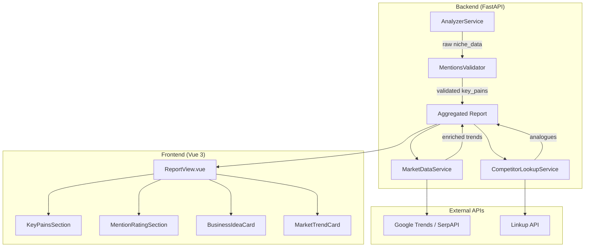
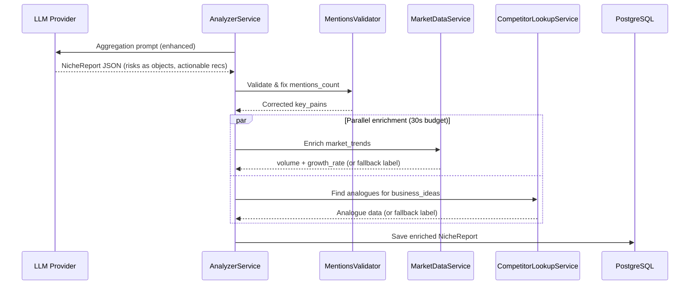

# Design Document: Report Improvements

## Overview

Комплексная доработка подсистемы отчётов BizMap в режиме `niche_search`. Затрагивает три слоя:
1. **Backend (Python/FastAPI)** — валидация данных, новые Pydantic-модели, интеграция внешних API (Google Trends, Linkup), обогащённые LLM-промпты
2. **Frontend (Vue 3 + TypeScript)** — редизайн карточек, визуальное разделение секций, отображение новых структурированных данных
3. **LLM Prompts** — переработка `NICHE_AGGREGATION_PROMPT` для генерации структурированных рисков, actionable-рекомендаций и корректных mentions_count

### Ключевые архитектурные решения

| Решение | Обоснование |
|---------|-------------|
| Валидация mentions_count на backend post-LLM | LLM не гарантирует корректные числа — нужен fallback через keyword matching |
| Внешние API вызываются после LLM-агрегации | Обогащение реальными данными идёт параллельно, не блокируя основной пайплайн |
| Timeout 30с на обогащение | Не замедлять отдачу отчёта; graceful fallback на LLM-данные |
| Risks как структурированные объекты | Замена `list[str]` на `list[Risk]` с category/description/mitigation |
| Recommendations с timeframe-префиксом | LLM генерирует в нужном формате через промпт; backend валидирует формат |

## Architecture

### Высокоуровневая архитектура (изменения выделены)



### Поток данных обогащения



## Components and Interfaces

### Новые backend-сервисы

#### 1. `MentionsValidator` (app/services/mentions_validator.py)

```python
class MentionsValidator:
    """Validates and corrects mentions_count in key_pains after LLM generation."""

    def validate_and_fix(
        self, 
        key_pains: list[KeyPain], 
        source_posts: list[dict]
    ) -> list[KeyPain]:
        """
        1. For each pain with mentions_count == 0: keyword-recount from source_posts
        2. If still 0 after recount: assign 1
        3. Sort descending by mentions_count (stable sort)
        4. Ensure all mentions_count >= 1
        """
        ...

    def _keyword_recount(self, pain: KeyPain, posts: list[dict]) -> int:
        """Count posts/comments containing keywords from pain.description."""
        ...
```

#### 2. `MarketDataService` (app/services/market_data.py)

```python
class MarketDataService:
    """Enriches MarketTrend entries with real market data from external sources."""

    def __init__(self, api_key: str | None = None, timeout: float = 10.0):
        self.api_key = api_key or settings.serpapi_key
        self.timeout = timeout

    async def enrich_trends(
        self,
        trends: list[MarketTrend],
        total_timeout: float = 30.0,
    ) -> list[MarketTrend]:
        """
        Enrich each trend with market_volume_estimate and growth_rate_percent.
        Falls back to LLM label if timeout or API error.
        """
        ...

    async def _query_trend_data(self, keywords: list[str]) -> dict | None:
        """Query Google Trends / SerpAPI for volume and growth data."""
        ...

    def _adjust_for_inflation(self, nominal_rate: float, inflation_rate: float) -> float:
        """Subtract inflation from nominal growth: real_growth = nominal - inflation."""
        ...
```

#### 3. `CompetitorLookupService` (app/services/competitor_lookup.py)

```python
class CompetitorLookupService:
    """Finds analogous businesses for each BusinessIdea via external APIs."""

    def __init__(self, api_key: str | None = None, timeout: float = 10.0):
        self.api_key = api_key or settings.linkup_api_key
        self.timeout = timeout

    async def find_analogues(
        self,
        ideas: list[BusinessIdea],
        total_timeout: float = 30.0,
    ) -> list[BusinessIdea]:
        """
        For each idea, find 1-3 analogous businesses.
        Populates idea.analogues list.
        Falls back to positive "market may be empty" or error messages.
        """
        ...

    async def _search_competitors(self, idea_name: str, description: str) -> list[Analogue]:
        """Search Linkup API for competitors matching the idea."""
        ...
```

#### 4. Enhanced `AnalyzerService` changes

```python
# In analyzer.py — modifications to existing service:

# 1. Updated NICHE_AGGREGATION_PROMPT with:
#    - Structured risks (5 categories, mitigation actions)
#    - Actionable recommendations (timeframe prefix, tools/platforms)
#    - 5-7 recommendations per idea covering 5 stages

# 2. Post-aggregation pipeline:
async def aggregate_and_enrich(self, results, source_posts, analysis_mode):
    """Aggregate + validate + enrich."""
    report = await self.hierarchical_aggregate(results, analysis_mode=analysis_mode)
    
    if analysis_mode == "niche_search":
        # Validate mentions
        validator = MentionsValidator()
        report["key_pains"] = validator.validate_and_fix(report["key_pains"], source_posts)
        
        # Enrich in parallel with timeout
        market_svc = MarketDataService()
        competitor_svc = CompetitorLookupService()
        
        report["market_trends"], report["business_ideas"] = await asyncio.gather(
            market_svc.enrich_trends(report["market_trends"]),
            competitor_svc.find_analogues(report["business_ideas"]),
        )
    
    return report
```

### Frontend-компоненты (изменения)

#### ReportView.vue — структурные изменения

1. **KeyPainsSection** — отдельный блок с фоном `bg-emerald-50`, заголовком «🔥 ТОП Ключевых болей», подзаголовком «Формулировки проблем с цитатами»
2. **MentionRatingSection** — отдельный блок с фоном `bg-slate-50`, заголовком «📊 Рейтинг упоминаний», подзаголовком «Количественная частота упоминаний», вертикальный разделитель при >=1024px
3. **BusinessIdeaCard** — новые суб-блоки: `AnaloguesBlock`, `RisksGrouped`, `ActionableRecommendations`
4. **MarketTrendCard** — отображение `market_volume_estimate` и `growth_rate_percent` с fallback-лейблом

## Data Models

### Изменения в Pydantic-моделях (backend/app/models/schemas.py)

#### Новые модели

```python
class Risk(BaseModel):
    """A structured risk assessment for a business idea."""
    category: str  # "Market Risk" | "Product Risk" | "Customer Risk" | "Execution Risk" | "Financial Risk"
    description: str  # 1-3 sentences specific to the idea
    mitigation: str  # 1-2 sentences actionable step

class Analogue(BaseModel):
    """An analogous business found via competitor lookup."""
    company_name: str
    description: str  # max 200 chars
    annual_revenue: str | None = None  # e.g., "$2M/год" or "~150 млн ₽/год"
    investment_round: str | None = None  # e.g., "Series A — $5M"
    has_ru_competitor: bool | None = None  # competitors exist in Russia

class MarketTrend(BaseModel):
    """A market or technology trend amplifying the problem."""
    name: str
    description: str
    monetization_hint: str
    market_volume_estimate: str | None = None  # e.g., "~2.5 млрд ₽"
    growth_rate_percent: float | None = None  # YoY real growth after inflation
    data_source_label: str | None = None  # "Оценка ИИ (реальные данные недоступны)" or None

class BusinessIdea(BaseModel):
    """A concrete business idea with full analysis."""
    name: str
    description: str
    mvp_plan: str
    demand_level: str = ""
    competition_level: str = ""
    launch_recommendations: list[str] = []  # Now: structured timeframe-prefixed strings
    risks: list[Risk] = []  # CHANGED: list[str] → list[Risk]
    positioning: str = ""
    search_queries: list[str] = []
    entry_difficulty: str = ""
    analogues: list[Analogue] = []  # NEW

class KeyPain(BaseModel):
    """A key user pain point with frequency and emotional charge."""
    description: str
    frequency: str
    emotional_charge: str
    mentions_count: int = 0  # Validated to be >= 1 post-LLM
    examples: list[str] = []
```

### Изменения в TypeScript-интерфейсах (frontend/src/types/api.ts)

```typescript
export interface Risk {
  category: string  // "Market Risk" | "Product Risk" | "Customer Risk" | "Execution Risk" | "Financial Risk"
  description: string
  mitigation: string
}

export interface Analogue {
  company_name: string
  description: string
  annual_revenue?: string | null
  investment_round?: string | null
  has_ru_competitor?: boolean | null
}

export interface MarketTrend {
  name: string
  description: string
  monetization_hint: string
  market_volume_estimate?: string | null
  growth_rate_percent?: number | null
  data_source_label?: string | null
}

export interface BusinessIdea {
  name: string
  description: string
  mvp_plan: string
  demand_level?: string
  competition_level?: string
  launch_recommendations?: string[]
  risks?: Risk[]  // CHANGED: string[] → Risk[]
  positioning?: string
  search_queries?: string[]
  entry_difficulty?: string
  analogues?: Analogue[]  // NEW
}
```

### Изменения в config.py

```python
class Settings(BaseSettings):
    # ... existing settings ...
    
    # Market Data enrichment
    serpapi_key: str = ""  # SerpAPI key for Google Trends data
    inflation_rate_percent: float = 9.5  # CBR official rate, updated periodically
    
    # Competitor Lookup
    linkup_api_key: str = ""  # Linkup API key for competitor search
    
    # Enrichment timeouts
    enrichment_total_timeout: float = 30.0  # Total budget for all enrichment
    enrichment_per_source_timeout: float = 10.0  # Per-source request timeout
```

### Миграция БД

Колонка `niche_data` в таблице `reports` хранит JSON — миграция схемы не требуется на уровне PostgreSQL. Новые поля (`analogues`, structured `risks`, `market_volume_estimate`, `growth_rate_percent`, `data_source_label`) будут сериализованы в существующий JSONB-столбец.

**Обратная совместимость**: все новые поля имеют `default=None` или `default=[]`, что обеспечивает чтение старых отчётов без ошибок.


## Correctness Properties

*A property is a characteristic or behavior that should hold true across all valid executions of a system — essentially, a formal statement about what the system should do. Properties serve as the bridge between human-readable specifications and machine-verifiable correctness guarantees.*

### Property 1: Mentions count minimum invariant

*For any* list of KeyPain objects passed through MentionsValidator, every item in the output list SHALL have mentions_count >= 1, regardless of the input mentions_count values (including 0 or negative).

**Validates: Requirements 1.1, 1.5**

### Property 2: Keyword recount correctness

*For any* KeyPain with mentions_count == 0 and any set of source posts, the keyword recount function SHALL return a count equal to the number of posts whose text (title + body + comments) contains at least one significant keyword extracted from the pain's description.

**Validates: Requirements 1.4**

### Property 3: Key pains descending stable sort

*For any* list of KeyPain objects after validation, sorting SHALL produce a list where each element's mentions_count is >= the next element's mentions_count, AND for any two elements with equal mentions_count their relative order matches their order in the input (stable sort).

**Validates: Requirements 1.3, 1.6**

### Property 4: Mentions count sum on merge

*For any* set of KeyPain lists from different chunks containing pains with matching descriptions, the merge operation SHALL produce a single KeyPain whose mentions_count equals the sum of all individual mentions_count values from the matching pains.

**Validates: Requirements 1.2**

### Property 5: Inflation adjustment arithmetic

*For any* nominal growth rate and inflation rate (both floats), the `_adjust_for_inflation` function SHALL return a value equal to `nominal_growth - inflation_rate`.

**Validates: Requirements 3.3**

### Property 6: Market data display format

*For any* MarketTrend with non-null market_volume_estimate and growth_rate_percent, the rendered display string SHALL match the format "Объём рынка: ~{volume} {currency_symbol}, Рост: +{rate}% г/г с учётом инфляции" where volume and currency_symbol come from market_volume_estimate and rate equals growth_rate_percent.

**Validates: Requirements 3.5**

### Property 7: Analogue description length constraint

*For any* Analogue object stored in a BusinessIdea, the description field SHALL have a length of at most 200 characters.

**Validates: Requirements 4.2**

### Property 8: Investment round format

*For any* Analogue with non-null investment_round, the value SHALL match the format "Раунд: {stage} — {amount}" where stage and amount are non-empty strings.

**Validates: Requirements 4.6**

### Property 9: Risk object structural validity

*For any* Risk object in a BusinessIdea, the category SHALL be one of exactly 5 values ("Market Risk", "Product Risk", "Customer Risk", "Execution Risk", "Financial Risk"), the description SHALL contain between 1 and 3 sentences, and the mitigation SHALL contain between 1 and 2 sentences.

**Validates: Requirements 5.1, 5.2**

### Property 10: Risks count and category diversity invariant

*For any* BusinessIdea in the final validated report, the risks list SHALL contain between 3 and 6 items inclusive, and the set of distinct categories across those risks SHALL contain at least 2 different values.

**Validates: Requirements 5.5, 5.6**

### Property 11: Recommendation structure validity

*For any* launch recommendation string in a BusinessIdea, the string SHALL start with a timeframe prefix matching the pattern "За N дней:" or "За N недель:" (where N is a positive integer), and SHALL contain at least one named tool, platform, or channel from the known Russian-market set.

**Validates: Requirements 6.1, 6.3**

### Property 12: Recommendations ascending timeframe order

*For any* BusinessIdea with launch_recommendations, the numeric timeframe values extracted from each recommendation's prefix SHALL form a non-decreasing sequence (earlier steps first).

**Validates: Requirements 6.2**

### Property 13: Recommendations count and stage coverage

*For any* BusinessIdea in the final validated report, launch_recommendations SHALL contain between 5 and 7 items, covering all 5 stages: validation, MVP build, first users acquisition, monetization test, and scaling decision.

**Validates: Requirements 6.5**

## Error Handling

### External API failures (Market Data & Competitor Lookup)

| Ошибка | Поведение | Fallback |
|--------|-----------|----------|
| Timeout (10s per source) | Прерывание запроса | MarketTrend: `data_source_label = "Оценка ИИ (реальные данные недоступны)"` |
| Network error | Логирование, продолжение | BusinessIdea: `analogues = []`, отображение «Данные об аналогах временно недоступны» |
| API rate limit (429) | Retry с экспоненциальным backoff (1 попытка) | Fallback на LLM-данные |
| Total enrichment > 30s | Прерывание всех оставшихся запросов | Fallback на LLM-данные для необогащённых элементов |
| Invalid API response | Логирование, skip enrichment | Fallback на LLM-данные |

### LLM output validation failures

| Ошибка | Поведение | Fallback |
|--------|-----------|----------|
| mentions_count == 0 | Keyword recount → если 0, assign 1 | Гарантия >= 1 |
| Risks count < 3 or > 6 | Re-prompt LLM (1 retry) | Trim to 6 or pad из недопредставленных категорий до 3 |
| Recommendations count < 5 or > 7 | Re-prompt LLM (1 retry) | Trim to 7 from end, or pad underrepresented stage to reach 5 |
| Risk category not in allowed set | Map to closest category or assign "Execution Risk" | Логирование warning |
| Recommendation missing timeframe prefix | Prepend "За 7 дней:" as default | Логирование warning |
| Recommendation missing tool/platform | Append generic "через целевые каналы" | Не блокирует отображение |

### Frontend error states

- **Loading state**: показывать skeleton для обогащённых секций (analogues, market data)
- **Partial data**: если `data_source_label` присутствует — показать badge «ИИ-оценка»
- **Empty analogues**: показать позитивный сигнал «Рынок может быть незанят»
- **Network error on report load**: показать `rv-error` блок с кнопкой «Вернуться»

## Testing Strategy

### Property-Based Tests (Hypothesis)

Библиотека: **Hypothesis** (уже используется в проекте).

Каждый property-test запускается с **минимум 100 итерациями** и тегируется комментарием с номером свойства.

```python
# Пример: test_mentions_validator.py
from hypothesis import given, settings, strategies as st

@settings(max_examples=100)
@given(
    key_pains=st.lists(st.builds(KeyPain, mentions_count=st.integers(min_value=-10, max_value=100)), min_size=1, max_size=20),
    source_posts=st.lists(st.dictionaries(keys=st.text(), values=st.text()), min_size=0, max_size=50)
)
def test_mentions_count_minimum_invariant(key_pains, source_posts):
    """Feature: report-improvements, Property 1: Mentions count minimum invariant"""
    validator = MentionsValidator()
    result = validator.validate_and_fix(key_pains, source_posts)
    assert all(p.mentions_count >= 1 for p in result)
```

**Покрытие свойствами:**

| Property | Тестируемый модуль | Генераторы |
|----------|-------------------|------------|
| 1 (mentions >= 1) | MentionsValidator | Random KeyPain lists, random posts |
| 2 (keyword recount) | MentionsValidator._keyword_recount | Random pain descriptions, random posts with/without keywords |
| 3 (descending stable sort) | MentionsValidator | Random KeyPain lists with duplicate counts |
| 4 (sum on merge) | MentionsValidator merge logic | Random partial result lists with overlapping descriptions |
| 5 (inflation adjustment) | MarketDataService._adjust_for_inflation | Random float pairs |
| 6 (display format) | MarketTrend formatter | Random MarketTrend with valid volume/rate |
| 7 (description <= 200) | CompetitorLookupService | Random Analogue with long descriptions |
| 8 (investment round format) | Analogue formatter | Random stage/amount strings |
| 9 (Risk structure) | Risk validator | Random Risk objects |
| 10 (risks count + diversity) | BusinessIdea validator | Random BusinessIdea with risk lists |
| 11 (recommendation format) | Recommendation validator | Random recommendation strings |
| 12 (ascending timeframe) | Recommendation sorter | Random recommendation lists |
| 13 (recs count + stages) | BusinessIdea validator | Random BusinessIdea with rec lists |

### Unit Tests (pytest)

- Проверка fallback-сообщений для каждого error state
- Проверка prompt содержит инструкции для framework-based risks
- Проверка парсинга LLM JSON response с новыми полями (risks as objects)
- Проверка backward compatibility: старые отчёты (risks as strings) читаются без ошибок

### Integration Tests

- Mock SerpAPI → verify enrichment pipeline completes
- Mock Linkup API → verify analogues populated correctly
- Timeout simulation → verify fallback labels applied
- Full pipeline test: chunk → analyze → aggregate → validate → enrich → save

### Frontend Tests

- Component tests (Vitest + Vue Test Utils): проверка рендеринга карточек с новыми данными
- Snapshot tests: KeyPainsSection, MentionRatingSection, BusinessIdeaCard, MarketTrendCard
- Responsive layout tests: two-column при ≥1024px, single-column при <1024px
