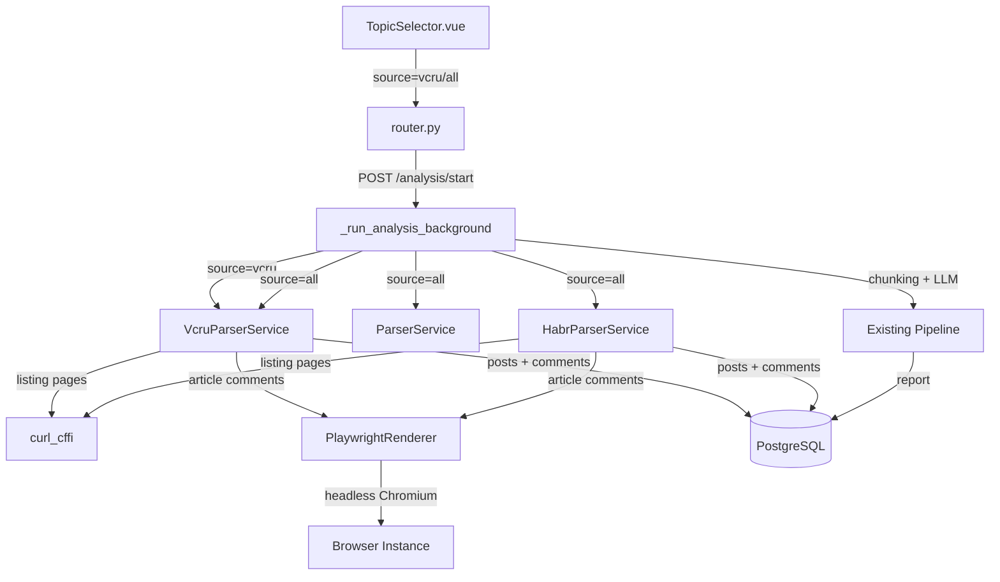

# Дизайн-документ: Интеграция VC.ru + Playwright

## Обзор

Расширение Topic Analyzer тремя ключевыми изменениями:

1. **PlaywrightRenderer** — общий модуль для рендеринга JS-контента через headless Chromium. Используется для загрузки комментариев с VC.ru и Habr (оба сайта рендерят комментарии через JavaScript).
2. **VcruParserService** — новый парсер для vc.ru, аналогичный HabrParserService. Использует curl_cffi для страниц категорий (статический HTML) и PlaywrightRenderer для страниц статей (комментарии).
3. **Обновление HabrParserService** — метод `parse_comments` переключается с curl_cffi на PlaywrightRenderer.

Дополнительно: обновление UI (4 источника вместо 3), API (новый параметр `vcru_topic_id`), pipeline (поддержка source="vcru" и source="all").

### Результаты исследования

**Структура HTML VC.ru:**
- VC.ru (платформа Osnova) использует SPA-подход — страницы категорий загружают статьи через JavaScript (infinite scroll)
- URL статей: `https://vc.ru/{category}/{article_id}-{slug}` (например, `https://vc.ru/dev/2874515-dzhuny-v-it-pochemu-rinok-ne-nuzhdaetsya-v-novichkakh`)
- Article ID — числовой, извлекается из URL
- Комментарии на страницах статей рендерятся через JS — требуется Playwright
- Страницы категорий также рендерятся через JS, но начальный HTML содержит данные статей в JSON-формате внутри `<script>` тегов

**Пагинация VC.ru:**
- VC.ru использует infinite scroll через внутренний API `api.vc.ru/v2.8/`
- Для парсинга категорийных страниц используем curl_cffi с прямым запросом к HTML — первая порция статей доступна в SSR-контенте
- Для последующих страниц: используем параметр `?page=N` или `lastId`/`lastSortingValue` через API
- Практический подход: парсим HTML первой страницы через curl_cffi, для пагинации используем `?page=N` (VC.ru поддерживает серверный рендеринг первых страниц)

## Архитектура



### Поток данных

1. Пользователь выбирает source="vcru" и категорию → API создаёт AnalysisTask
2. Background task запускает VcruParserService
3. VcruParserService загружает listing page через curl_cffi → извлекает статьи
4. Для каждой статьи: PlaywrightRenderer открывает страницу → ждёт загрузки комментариев → возвращает HTML
5. VcruParserService парсит комментарии из HTML → сохраняет в БД
6. Данные проходят через существующий pipeline: chunking → LLM → aggregation → report

## Компоненты и интерфейсы

### 1. PlaywrightRenderer (`backend/app/services/playwright_renderer.py`)

Новый модуль. Async context manager для управления headless Chromium.

```python
class PlaywrightRenderer:
    """Manages a headless Chromium browser for rendering JS-heavy pages."""
    
    def __init__(self) -> None:
        self._playwright = None
        self._browser = None
    
    async def __aenter__(self) -> "PlaywrightRenderer":
        """Launch browser on context entry."""
        self._playwright = await async_playwright().start()
        self._browser = await self._playwright.chromium.launch(headless=True)
        return self
    
    async def __aexit__(self, exc_type, exc_val, exc_tb) -> None:
        """Close browser on context exit (even on exception)."""
        if self._browser:
            await self._browser.close()
        if self._playwright:
            await self._playwright.stop()
    
    async def render_page(
        self, url: str, wait_selector: str, timeout: int = 30000
    ) -> str:
        """Navigate to URL, wait for selector, return rendered HTML.
        
        Returns empty string on timeout or error.
        """
        page = await self._browser.new_page()
        try:
            await page.goto(url, timeout=timeout)
            await page.wait_for_selector(wait_selector, timeout=timeout)
            return await page.content()
        except Exception:
            return ""
        finally:
            await page.close()
```

### 2. VcruParserService (`backend/app/services/vcru_parser.py`)

Новый модуль. Структура аналогична HabrParserService.

```python
class VcruParserService:
    """Parses articles and comments from vc.ru categories."""
    
    def __init__(self, session: AsyncSession) -> None:
        self._session = session
    
    async def parse_topic(
        self, topic_id: int, callback: ProgressCallback = None, days: int = 30
    ) -> dict:
        """Parse articles + comments for a VC.ru category."""
    
    async def parse_posts(self, category_url: str, since: datetime) -> list[dict]:
        """Fetch articles from category page with pagination."""
    
    async def parse_comments(
        self, article_url: str, renderer: PlaywrightRenderer
    ) -> list[dict]:
        """Fetch comments using PlaywrightRenderer."""
    
    # Static HTML parsing methods
    @staticmethod
    def _extract_posts_from_html(html: str) -> list[dict]: ...
    
    @staticmethod
    def _extract_comments_from_html(html: str) -> list[dict]: ...
```

Ключевые отличия от HabrParserService:
- `parse_comments` принимает `PlaywrightRenderer` как параметр (не создаёт свой)
- `parse_topic` создаёт один `PlaywrightRenderer` контекст для всех статей
- ID статей: `vcru_{article_id}`, ID комментариев: `vcru_comment_{comment_id}`
- Все посты сохраняются с `source="vcru"`

### 3. Изменения в HabrParserService (`backend/app/services/habr_parser.py`)

Минимальные изменения:
- `parse_comments` теперь принимает опциональный `PlaywrightRenderer`
- Если renderer передан — использует его вместо `_fetch_page`
- `parse_posts` остаётся без изменений (curl_cffi)
- `parse_topic` создаёт `PlaywrightRenderer` контекст и передаёт в `parse_comments`

```python
# В parse_topic:
async with PlaywrightRenderer() as renderer:
    for post_data in posts_data:
        comments = await self.parse_comments(post_data["url"], renderer=renderer)
        ...

# В parse_comments:
async def parse_comments(
    self, article_url: str, renderer: PlaywrightRenderer | None = None
) -> list[dict]:
    if renderer:
        html = await renderer.render_page(
            article_url, 
            wait_selector=".tm-comment-thread__comment",
            timeout=30000
        )
    else:
        html = await self._fetch_page(article_url)
    return self._extract_comments_from_html(html)
```

### 4. Изменения в TopicManager (`backend/app/services/topic_manager.py`)

- Добавить `VCRU_CATEGORIES` — список из 39 категорий
- Обновить `fetch_topics` для поддержки `source="vcru"` и `source="all"`
- `source="all"` заменяет `source="both"` (обратная совместимость: "both" → "all" с pikabu+habr)

```python
VCRU_CATEGORIES = [
    {"pikabu_id": "vcru_ai", "name": "AI", "url": "https://vc.ru/ai", "subscribers_count": None, "source": "vcru"},
    {"pikabu_id": "vcru_dev", "name": "Разработка", "url": "https://vc.ru/dev", "subscribers_count": None, "source": "vcru"},
    # ... 39 категорий
]
```

### 5. Изменения в API (`backend/app/api/router.py`)

- `AnalysisStartRequest`: добавить `vcru_topic_id: int | None = None`
- Валидация: `source="all"` требует `topic_id`, `habr_topic_id` и `vcru_topic_id`
- `source="vcru"` использует `topic_id` как ID категории VC.ru
- `GET /api/topics?source=vcru` и `source=all`
- `_run_analysis_background`: добавить ветку для `source="vcru"` и обновить `source="all"`

### 6. Изменения в schemas.py

```python
class AnalysisStartRequest(BaseModel):
    topic_id: int
    days: int = 30
    source: str = "pikabu"
    habr_topic_id: int | None = None
    vcru_topic_id: int | None = None  # NEW
```

### 7. Изменения во фронтенде

**TopicSelector.vue:**
- `SourceMode` → `'pikabu' | 'habr' | 'vcru' | 'all'`
- Режим "all": три колонки (Pikabu, Habr, VC.ru)
- Новый ref: `vcruTopics`, `selectedVcruTopic`
- `startAnalysis` передаёт `vcru_topic_id`

**api/client.ts:**
- `startAnalysis` принимает `vcruTopicId?: number`

**types/api.ts:**
- `AnalysisStartRequest`: добавить `vcru_topic_id?: number`

**ReportView.vue:**
- `sourcesLabel`: добавить маппинг для "vcru" и "pikabu,habr,vcru"

### 8. CSS-селекторы для VC.ru

На основе анализа HTML-структуры VC.ru (платформа Osnova):

**Страница категории (listing):**
- Карточка статьи: `div.feed__item, article.l-entry`
- Заголовок: `a.content-link` или `h2.content-title`
- Текст: `.content-body, .l-entry__content`
- Дата: `time[datetime], .content-header-author__publish-date time`
- Рейтинг: `.vote__value, .likes__counter`
- Комментарии: `.comments-counter__value`
- URL статьи: из `href` ссылки заголовка

**Страница статьи (comments — через Playwright):**
- Блок комментария: `.comment, .comments__item`
- Текст комментария: `.comment__text, .comment__content`
- Дата комментария: `.comment__date time[datetime]`
- Рейтинг комментария: `.comment__rating-value, .vote__value`
- ID комментария: из атрибута `data-id` или `id`

> **Примечание:** CSS-селекторы требуют верификации на реальных страницах VC.ru. Платформа Osnova периодически обновляет вёрстку. Парсер должен использовать fallback-селекторы (несколько вариантов через запятую), как это сделано в существующих парсерах Pikabu и Habr.

## Модели данных

### Изменения в существующих моделях

Новых таблиц не требуется. Все данные VC.ru используют существующие таблицы:

| Таблица | Поле | Значение для VC.ru |
|---------|------|--------------------|
| `topics` | `source` | `"vcru"` |
| `topics` | `pikabu_id` | `"vcru_{category}"` (например, `"vcru_dev"`) |
| `topics` | `url` | `"https://vc.ru/{category}"` |
| `posts` | `source` | `"vcru"` |
| `posts` | `pikabu_post_id` | `"vcru_{article_id}"` |
| `comments` | `pikabu_comment_id` | `"vcru_comment_{comment_id}"` |
| `reports` | `sources` | `"vcru"` или `"pikabu,habr,vcru"` |

### Миграция БД

Миграция не требуется — поле `source` в таблицах `topics` и `posts` уже существует как `String(20)`, значение `"vcru"` помещается без изменений.

### Конфигурация (`backend/app/config.py`)

Новые настройки не требуются. VC.ru не требует прокси (в отличие от Pikabu).

## Свойства корректности

*Свойство корректности — это характеристика или поведение, которое должно выполняться при всех допустимых выполнениях системы. Свойства служат мостом между человекочитаемыми спецификациями и машинно-проверяемыми гарантиями корректности.*

### Свойство 1: Формирование URL категории

*Для любого* валидного slug категории VC.ru, сформированный URL должен соответствовать шаблону `https://vc.ru/{slug}` и быть валидным URL.

**Validates: Requirements 1.2**

### Свойство 2: Фильтрация тем по источнику

*Для любого* набора тем с разными значениями source и *для любого* значения фильтра source, результат фильтрации должен содержать только темы с соответствующим source (или все темы при source="all").

**Validates: Requirements 1.4, 1.5**

### Свойство 3: Извлечение данных статьи из HTML

*Для любого* валидного HTML-фрагмента карточки статьи VC.ru, содержащего заголовок, текст, дату, рейтинг, количество комментариев и URL, парсер должен извлечь все эти поля без потери данных.

**Validates: Requirements 2.2**

### Свойство 4: Форматирование идентификаторов сущностей

*Для любого* числового ID статьи, сформированный идентификатор должен соответствовать формату `vcru_{id}`. *Для любого* числового ID комментария, сформированный идентификатор должен соответствовать формату `vcru_comment_{id}`.

**Validates: Requirements 2.3, 3.5**

### Свойство 5: Остановка пагинации по дате

*Для любого* набора статей на странице, где все статьи опубликованы раньше заданной даты cutoff, пагинация должна прекратиться (не загружать следующую страницу).

**Validates: Requirements 2.6**

### Свойство 6: Извлечение данных комментария из HTML

*Для любого* валидного HTML-фрагмента комментария VC.ru, содержащего текст, дату, рейтинг и ID, парсер должен извлечь все эти поля без потери данных.

**Validates: Requirements 3.4**

### Свойство 7: Валидация запроса source="all"

*Для любой* комбинации присутствующих/отсутствующих topic_id, habr_topic_id и vcru_topic_id при source="all", запрос должен быть отклонён, если хотя бы один из трёх ID отсутствует.

**Validates: Requirements 7.4**

### Свойство 8: Маппинг sources в отображаемую метку

*Для любого* валидного значения поля sources (из множества: "pikabu", "habr", "vcru", "pikabu,habr", "pikabu,habr,vcru"), функция маппинга должна возвращать корректную человекочитаемую строку.

**Validates: Requirements 9.2, 9.3**

### Свойство 9: Жизненный цикл контекстного менеджера PlaywrightRenderer

*Для любой* последовательности вызовов render_page внутри контекста, браузер должен быть запущен при входе в контекст и закрыт при выходе (включая выход по исключению).

**Validates: Requirements 10.1, 10.2, 10.4**

## Обработка ошибок

| Ситуация | Поведение |
|----------|-----------|
| HTTP 429 от VC.ru | Пауза 60 сек, до 5 повторов |
| HTTP 5xx от VC.ru | Пауза 10 сек, до 3 повторов |
| Сетевая ошибка | Пауза 15 сек, до 3 повторов |
| Playwright timeout (30 сек) | Возврат пустой строки, лог warning, продолжение |
| Playwright crash | Закрытие браузера через `__aexit__`, лог error |
| Ошибка парсинга одной статьи | Лог warning, пропуск статьи, продолжение |
| Ошибка парсинга комментариев | Лог warning, пропуск комментариев, продолжение |
| Невалидный source в API | HTTP 400 с описанием ошибки |
| Отсутствующий vcru_topic_id при source="all" | HTTP 400 |

## Стратегия тестирования

### Property-based тесты (Hypothesis)

Библиотека: `hypothesis` (уже в зависимостях проекта).

Каждый property-тест запускается минимум 100 итераций. Теги в формате:
`Feature: vcru-playwright-integration, Property N: {описание}`

Свойства 1–8 реализуются как property-based тесты:
- Свойство 1: генерация случайных slug → проверка URL
- Свойство 2: генерация случайных наборов Topic с разными source → проверка фильтрации
- Свойство 3: генерация случайного HTML с известными значениями полей → проверка извлечения
- Свойство 4: генерация случайных числовых ID → проверка формата строки
- Свойство 5: генерация случайных дат и cutoff → проверка решения о пагинации
- Свойство 6: генерация случайного HTML комментария → проверка извлечения
- Свойство 7: генерация случайных комбинаций None/int для трёх topic_id → проверка валидации
- Свойство 8: перебор всех валидных значений sources → проверка маппинга

Свойство 9 (lifecycle) тестируется как example-based тест с моком Playwright.

### Unit-тесты (example-based)

- PlaywrightRenderer: context manager lifecycle, timeout handling, error recovery
- VcruParserService: retry logic (429, 5xx, network errors), конкретные примеры HTML
- HabrParserService: проверка что parse_comments использует renderer когда передан
- API router: валидация запросов, маршрутизация по source
- TopicManager: upsert категорий VC.ru, кеширование

### Integration-тесты

- Pipeline end-to-end с source="vcru" (моки для HTTP и Playwright)
- API endpoints с source="vcru" и source="all"
- Сохранение в БД с корректным source
